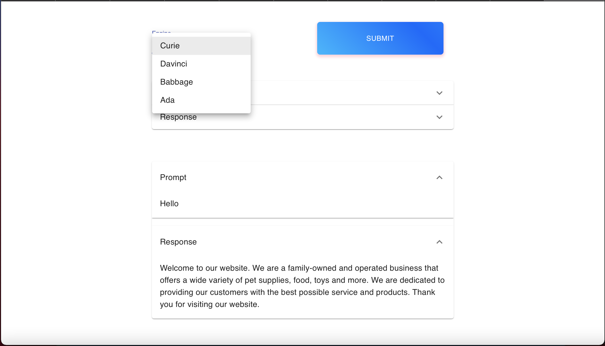

# Project URL

https://shopifyproject.herokuapp.com

## Project Overview

Robo Talk! is a web app that accesses OpenAI's GPT3 API to process plain text prompts and produce outputs that are very similar to the way a human will speak

## Technologies Used with the Project

1. React to create the UI
2. Redux for state management (I designed this project with scalability in mind, therefore I wanted to utilize Redux to allow the project to be easily extended in the future)
3. Redux Thunk to process functions in the actions
4. Lottie to display a pleasant and beautiful loading animation
5. JSDoc for documentation of each function used within the project

## Features of the Project

1. Fetch GPT3 responses data from a submitted prompt
2. Display the resulting data in a dynamic feed that includes the prompt and response in an accordion view

## Extra Features Included

The following extra features were specified in the challenge specifications

Extra features that were included are:

1. Saving responses to local storage so that the user can view their previous prompts and responses if they refresh or close the session
2. Allow the user to select the engine they want to use to process their prompts from a dropdown

## Additional Features Included

The following features were not explicitly specified in the challenge specifications but increase the user experience while using the app.

Additional features included in the project are:

1. Completely responsive web design
2. Documentation for the project using JSDoc
3. When no engine is specified the app will automatically select the Currie engine.
4. Hides the prompt and response description in an accordion view to minimize the amount of text on screen
5. Uses a custom linear gradient colour for the titles and button colours

## Screenshots

